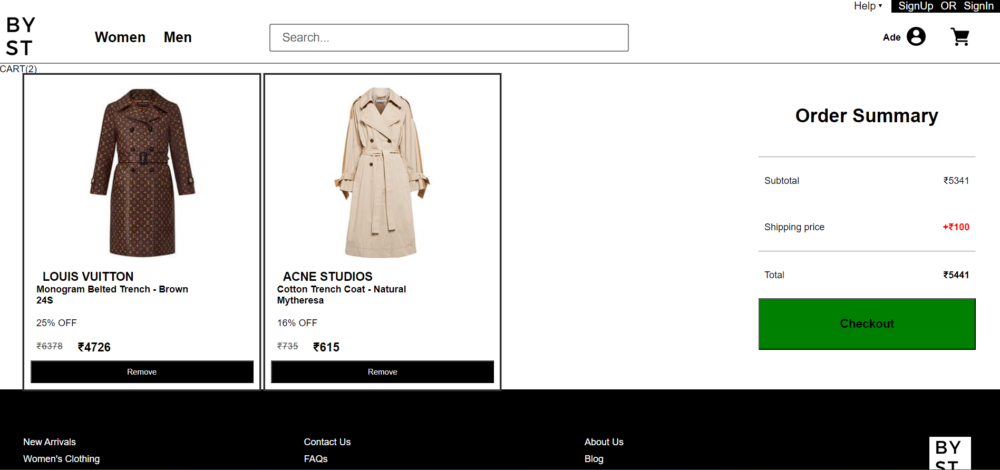

# Byst E-commerce website (Lyst clone)

## Introduction

BYST is a solo-developed passion project—a luxury fashion eCommerce website that reflects my dedication and expertise in web development. Crafted from scratch in a short timeframe, this visually appealing and intuitive platform allows fashion enthusiasts to explore and purchase premium products. Leveraging modern technologies like Node.js, Express, and MongoDB, I ensured a seamless shopping experience with a user-friendly shopping cart and personalized profiles. BYST serves as a testament to my commitment, and though you can't run it locally, your feedback and support are always welcome.

## Technologies

- Frontend: HTML, CSS, JavaScript 
- Backend: Node.js, Express
- Database: MongoDB 


## Features & Functionality

- Login-Signup: Users can create accounts and log in to the platform.
- Authentication: The application authenticates users to ensure secure access to user-specific features.
- Authorization: Role-based authorization is implemented to control access to certain functionalities.
- JWT: JSON Web Tokens are used for secure user authentication and authorization.
- Hashing and Salting Password: User passwords are securely hashed and salted before being stored in the database.
- User Relationship: The application manages relationships between users and their activities, such as orders and saved items.
- Sort Functionality: Users can sort products based on various criteria, such as price, popularity, or relevance.
- Add to Cart: Customers can add products to their shopping cart to make purchases later.
- Searching: A search feature is provided for users to find products based on keywords or specific criteria.


## Installation
> **Note:** Please note that while you can clone the repository and read the code to analyze the project's structure and implementation, it may not be directly runnable due to missing environment configurations. Nevertheless, you can still explore the codebase to learn and gain insights into building a premium luxury fashion e-commerce website using technologies like HTML, CSS, JavaScript, Node.js, Express, and MongoDB.


 Clone the repository.
```bash
git clone https://github.com/your_username/your_repository.git
```

## Deployment

The app is deployed and accessible at :- [Deployed Link](https://byst.netlify.app/)


## Screenshots

Include some screenshots of your project to visually showcase its appearance and features. You can add images like this:


### Home Page


### Register Page


### SignIn Page


### Cart Page



